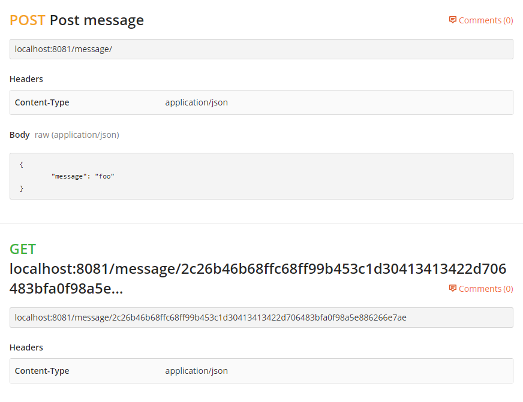

## Challange

### Create a small service deployed to a docker container that has two endpoints:

1. /messages takes a message (a string) as a POST and returns the SHA256 hash digest of that
message (in hexadecimal format)

2. /messages/<hash> is a GET request that returns the original message. A request to a non-existent
<hash> should return a 404 error.

## To run the service (port 8081) :

- docker-compose up --build

### Examples: 

## To run the (integration) tests:

 - docker pull mongo
 - docker run --rm -d -p 27017:27017 mongo
 - npm test

(kill the database container after the tests so we can run the application again)
docker kill $(docker ps -q)

# Questions

## What would the bottleneck(s) be in your implementation as you acquire more users?

## How would you improve your deployment process if you needed to mantain this application long term? 
